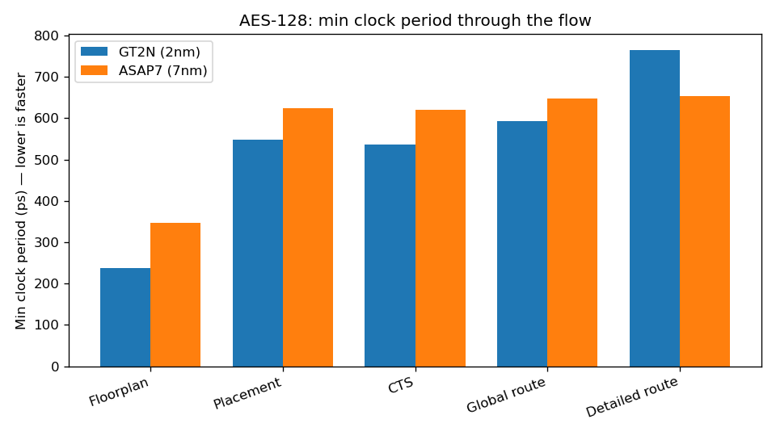

# GT2N on OpenROAD via bazel-orfs

This directory builds the GT2N PDK with the OpenROAD RTL-to-GDS flow using
[bazel-orfs](https://github.com/The-OpenROAD-Project/bazel-orfs), a thin set of
Bazel rules around [OpenROAD-flow-scripts](https://github.com/The-OpenROAD-Project/OpenROAD-flow-scripts)
(ORFS). The GT2N repo is the source of truth for the PDK; the platform here is
consumed as an out-of-repo PDK via the `orfs_pdk` rule.

## Why this exists

This gives the GT2N project a test setup that is fully under its own control:

- **Reproducible, self-contained.** Everything — PDK, designs, tool versions —
  is pinned here. Anyone with Bazelisk gets the same flow, no shared install.
- **Deal with churn on GT2N's terms.** OpenROAD and ORFS move fast, and GT2N
  exercises corners — a backside-power layer stack — that upstream CI doesn't.
  Because the tools are pinned, *GT2N developers* set the pace: reproduce a
  problem on a fixed commit, patch the pinned source until GT2N's own flow
  works, and upgrade when it suits GT2N — not when upstream lands a change. The
  same fix is then ready to send upstream, already proven on a real GT2N
  design. So pinning helps GT2N developers at least as much as the OpenROAD/ORFS
  maintainers it eventually reaches. See
  [Code agents and bazel](#code-agents-eg-claude-code-and-bazel).
- **A read on OpenROAD-on-GT2N.** The A/B comparison below gives a first sense
  of how OpenROAD performs with GT2N (timing through the stages, area), next to
  a known PDK (ASAP7).

## Setup

Install [Bazelisk](https://bazel.build/install/bazelisk) (follow the upstream
instructions). It reads `../.bazelversion` and fetches the matching Bazel. The
first run builds OpenROAD, OpenSTA, Yosys, ABC and GNU Make from source
(~30-60 min); later runs are incremental. No Docker and no system-installed EDA
tools are required.

## The one idea: stage targets

`orfs_flow(name = "gcd", ...)` in `BUILD.bazel` expands into one Bazel target
per flow stage. The stages, in order:

```
synth  floorplan  place  cts  grt  route  final  generate_abstract
```

So `//orfs:gcd` becomes `//orfs:gcd_synth`, `//orfs:gcd_floorplan`,
`//orfs:gcd_place`, `//orfs:gcd_cts`, `//orfs:gcd_grt`, `//orfs:gcd_route`,
`//orfs:gcd_final`, … and the ASAP7 flow gives the same set prefixed
`gcd_asap7_`. List them all with:

```bash
bazelisk query '//orfs:*'
```

`bazelisk build //orfs:<name>_<stage>` runs the flow up to and including that
stage; each stage depends on the previous, so Bazel runs only what's missing
and caches the rest. `bazelisk run //orfs:<name>_<stage> gui_<stage>` does the
same and then opens the result in the OpenROAD GUI. That pattern is the whole
interface — once you know it, you can drive any design to any stage.

Open the routed `gcd` in the OpenROAD GUI — GT2N, then the same RTL on ASAP7
to compare:

```bash
bazelisk run //orfs:gcd_route gui_route
bazelisk run //orfs:gcd_asap7_route gui_route
```

Both PDKs route through detailed route to a final GDS (`//orfs:gcd_final`,
`//orfs:gcd_asap7_final`). GT2N's backside-power stack only routes on a recent
OpenROAD — this module pins one that has it; see
[Known limitations](#known-limitations) for the one caveat (static IR analysis
is skipped).

## Where the artifacts and metrics live

Stage outputs land under the workspace, addressed by platform/design/variant:

```
bazel-out/*/bin/orfs/results/<platform>/gcd/base/   # ODB, DEF, GDS, .sdc per stage
bazel-out/*/bin/orfs/logs/<platform>/gcd/base/       # logs + per-stage metrics JSON
```

Each stage writes a metrics JSON (`4_1_cts.json`, `5_1_grt.json`, …) whose keys
are `<stage>__<category>__<metric>`, e.g. `globalroute__timing__fmax__clock:core_clock`
or `cts__design__instance__area`. Those JSONs are exactly what the A/B updater
reads — see `../tools/update_ab.py` for a worked example of pulling Fmax and
area out of them. Inspect one directly:

```bash
python3 -m json.tool bazel-out/*/bin/orfs/logs/gt2n/gcd/base/5_1_grt.json
```

## How the PDK and a design are wired

Two macros in `BUILD.bazel`, and you can copy either for your own work:

- `orfs_pdk(name = "gt2n", config = "platforms/gt2n/config.mk", srcs = glob(...),
  libs = glob(...))` turns a plain ORFS platform directory into a Bazel PDK. The
  `config.mk` references its collateral via `$(PLATFORM_DIR)`; the `glob` picks
  up every file under `platforms/gt2n/`, including the symlinked LEF/LIB/GDS.
- `orfs_flow(name = "gcd", pdk = ":gt2n", top = "gcd", verilog_files = [...],
  sources = {"SDC_FILE": [...]}, arguments = {...})` defines a design. Point
  `pdk` at `:gt2n` for GT2N or at a bundled PDK like `@orfs//flow:asap7`.

To add a design: drop its Verilog and an SDC under `designs/`, add one
`orfs_flow(...)`, and `bazelisk run //orfs:<name>_grt gui_grt`.

## Iterating

Floorplan/placement knobs live in each `orfs_flow`'s `arguments` (e.g.
`CORE_UTILIZATION`, `PLACE_DENSITY`); the clock target lives in the design's
`constraint.sdc`. Edit, then re-run a stage or `bazelisk run //:update-a-b` to
rebuild both flows and refresh the table below. Tools can be swapped per the
bazel-orfs docs — e.g. a real KLayout via `--@bazel-orfs//:klayout` in
`user.bazelrc` (see [Known limitations](#known-limitations)).

## Layout

```
orfs/
  BUILD.bazel              orfs_pdk(gt2n) + orfs_flow(gcd) + orfs_flow(gcd_asap7)
  platforms/gt2n/          GT2N ORFS platform (vendored from OpenROAD PR #4277)
    config.mk              platform variables; references collateral via $(PLATFORM_DIR)
    pdn.tcl tapcell.tcl fastroute.tcl setRC.tcl cells_clkgate.v
    gt2.lyt gt2.lyp gt2.layermap   KLayout tech / layer files
    lef/ lib/ gds/         symlinks to the repo's canonical collateral
  designs/src/gcd/gcd.v    gcd RTL (shared by both A/B flows)
  designs/gt2n/gcd/        gt2n constraints (+ config.mk for plain `make` ORFS)
  designs/asap7/gcd/       asap7 constraints
  example/                 vendored GT2N ORFS reference run (AES-128, FSPDN/BSPDN,
                           KLayout DRC/LVS decks, gt2n_compat_bspdn_proxy platform)
```

The `platforms/gt2n/{lef,lib,gds}` entries are symlinks to `techlib/`, `lef/tt/`,
`lib/tt/` and `gds/` at the repo root — one copy of every byte. Plain ORFS can
consume `platforms/gt2n/` and `designs/gt2n/` directly (e.g. symlink them under
`OpenROAD-flow-scripts/flow/`).

## Updating ORFS, OpenROAD and bazel-orfs

The tool pins live in `../MODULE.bazel` (the `bazel-orfs`, `orfs`, `openroad`
and `qt-bazel` commits) and `../.bazelrc`. To move them all to the latest
versions:

```bash
bazelisk run @bazel-orfs//:bump
```

This rewrites the `openroad`/ORFS/`bazel-orfs` pins in `../MODULE.bazel` in
place; commit the result. (Why pin at all: see [Why this exists](#why-this-exists).)

## A/B comparison: GT2N vs ASAP7

The same **AES-128** design is taken through both PDKs so the numbers can be
compared side by side (gcd is just a pipe-cleaner). Regenerate the table *and*
the plot after a flow change with:

```bash
bazelisk run //:update-a-b
```

That builds `//orfs:aes_final` and `//orfs:aes_asap7_final`, reads each stage's
metrics JSON, rewrites the table below, and renders `ab_clock_period.png`
(`tools/update_ab.py`, matplotlib).

<!-- A/B:START -->

Minimum clock period is derived from each stage's reported Fmax (`1e12 / fmax`, in ps); it grows through the flow as real parasitics land. Both PDKs run the same `aes` (AES-128) RTL all the way through detailed route to a final GDS.

| Metric | GT2N (2nm) | ASAP7 (7nm) |
| --- | --- | --- |
| Min clock period — Floorplan (ps) | 238.3 | 346.4 |
| Min clock period — Placement (ps) | 548.4 | 623.7 |
| Min clock period — CTS (ps) | 537.1 | 620.4 |
| Min clock period — Global route (ps) | 592.4 | 646.6 |
| Min clock period — Detailed route (ps) | 764.7 | 653.2 |
| Core utilization target (%) | 40 | 40 |
| Placement density target | 0.58 | 0.58 |
| Achieved utilization | 1.000 | 0.393 |
| Cell area (um^2) | 1110.680 | 1518.590 |
| Die area (um^2) | 1254.010 | 4134.880 |

_Same `aes` RTL through both PDKs. Regenerate with `bazelisk run //:update-a-b`._

<!-- A/B:END -->



The plot is the same per-stage min-clock-period data as the table, regenerated
by `//:update-a-b`. Read it as a flow-bring-up artifact, not a PPA claim — see
the two notes below.

### Core utilization

GT2N runs AES at a lower `CORE_UTILIZATION` than ASAP7, and that is about
*routing resources*, not the cells. The platform default exposes only the
**M2–M5** signal stack (4 layers); a real design like AES congests there in
global route at any useful density (`MAX_ROUTING_LAYER` is overridable in the
platform config for exactly this reason). AES therefore opens routing up to
**M10** and runs at **40%** — a value that routes comfortably, not the
squeezed-out maximum (the goal here is a good routing, not a PPA record). ASAP7,
with more routing layers and mature rules, packs to ~65%. So the gap reflects
GT2N's still-shallow default routing stack and
uncalibrated rules during bring-up; backside power should eventually *raise*
achievable utilization (PG moves off the frontside, freeing tracks), which is
exactly the kind of thing this setup exists to measure as the PDK matures.

### Why the 2nm clock-period lead doesn't survive to route

The device-speed advantage is real and visible **early**: at floorplan GT2N is
well ahead of ASAP7. It erodes through placement/CTS/route because GT2N's
parasitics here are **placeholder values** — `platforms/gt2n/setRC.tcl` says so
in caps, and its wire resistances (e.g. M2/M3 ≈ 259/156 Ω/µm) are large and
uncalibrated. With wire R that high, net delay becomes interconnect-dominated
and swamps the gate-delay lead by CTS. Interconnect-dominated delay *is* the
defining 2nm story (it's why backside power and new metals exist), but the
magnitude here is an artifact of fake RC + a clamped stack, not silicon. A fair
PPA read needs a calibrated RCX/QRC model (the repo ships `qrc/GT2.ict` +
`nxtgrd/` for that) and the real backside grid — [future work](#future-work).

## Code agents (e.g. Claude Code) and bazel

Because every tool is built from pinned source, a code agent can patch it in
place. Each `*_override()` in `../MODULE.bazel` takes a `patches`/`patch_cmds`
list (we already use one to vendor OpenROAD's submodules). So the loop is:

1. Point a code agent at the failure — e.g. the GT2N detailed-route segfault
   below. It edits the OpenROAD (or ORFS) source, drops the diff in `../patches/`,
   and adds it to that module's `patches = [...]`.
2. Bazel rebuilds only what changed and reruns the flow, so the agent gets a
   tight edit → `bazelisk run //orfs:gcd_final` → inspect loop until `gcd`
   actually routes. When the churn settles, you *know* the patch does what's
   needed, because the demo builds and runs with it.
3. Ask the agent to turn that same verified diff into an upstream pull request.

The fix you run locally is the *same* diff you upstream, already exercised by a
real flow — not a throwaway workaround.

The same loop also tells you when *not* to write a patch. GT2N detailed route
used to segfault here — it symbolized to a null `getDefaultViaDef()` in `drt`'s
`FlexTA_init.cpp`, and a check of OpenROAD master showed it had just been fixed
by PR #10547 (backside-power support), merged a day after the then-current pin.
So the action was a version bump, not a new patch: `../MODULE.bazel` now pins
`openroad` `dab0efb` and `gcd` routes to GDS. Reproducing on pinned source is
what surfaced that cleanly.

## Handing OpenROAD maintainers a self-contained reproducer

A bug in a stage is most actionable when a maintainer can rerun *that step* with
nothing installed. bazel-orfs packages exactly that: the per-stage
`<design>_<stage>_deps` target builds a self-contained archive with the design,
**all** the GT2N collateral (LEF/LIB/GDS/tech and the step's scripts), the
stage inputs (e.g. the global-route ODB) and the pinned OpenROAD itself. Because
OpenROAD and the PDK travel inside the archive, there's no ORFS checkout, no PDK
install, and no ORFS-version matching to worry about.

Build/deploy the detailed-route reproducer:

```bash
bazelisk run @bazel-orfs//:deps -- //orfs:aes_route
#  Deployed to: tmp/orfs/aes_route_deps
#  shareable archive at bazel-bin/orfs/aes_route_deps.tar.gz
```

Rerun detailed route standalone — bundled OpenROAD, bundled GT2N inputs:

```bash
tmp/orfs/aes_route_deps/make do-5_2_route
```

It starts with all of GT2N loaded — e.g.:

```
[INFO DRT-0149] Reading tech and libs.
[WARNING DRT-0122] Layer BPR is skipped for gt2_6t_and2_x1_w31_lvt/vdd.
...        # GT2N backside layers (BPR/BM*/BV*) and the w31 LVT standard cells
```

Hand `aes_route_deps.tar.gz` to an OpenROAD maintainer and they reproduce the
GT2N detailed-route behaviour at the exact versions pinned here — the same
pin/patch/upstream loop, now runnable on their side too.

## Known limitations

- **Static IR analysis is skipped for GT2N.** The GT2N flow sets empty
  `PWR_NETS_VOLTAGES`/`GND_NETS_VOLTAGES`, which disables PSM's static IR-drop
  check at finish. Power is delivered on the backside (BPR/BM*); without the
  real backside PG mesh wired into the netlist (the [`example/`](example) paints
  it in KLayout post-GDS), PSM sees the std cells as unconnected on vdd and
  fails its connectivity check. Signal routing, timing and the final GDS are all
  produced; only the IR report is omitted. Wiring a proper backside PG so IR
  analysis runs is [future work](#future-work).
- **Needs a recent OpenROAD (and this module pins one).** Routing GT2N's
  backside stack needs OpenROAD ≥ `e03cf07` — PR
  [#10547](https://github.com/The-OpenROAD-Project/OpenROAD/pull/10547)
  "Add LEF58_BACKSIDE support" (merged 2026-06-04), which the GT2N tech LEF's
  `PROPERTY LEF58_BACKSIDE` annotations rely on. Older OpenROADs segfault in
  `drt`'s `FlexTA_init.cpp` (null `cutLayer->getDefaultViaDef()`, since M0/M1 sit
  below `MIN_ROUTING_LAYER=M2`). `../MODULE.bazel` pins `openroad` `dab0efb`,
  which has it; that pin is exactly how this repo absorbed the churn on its own
  schedule.
- **No real GDS by default.** KLayout defaults to a mock that writes a dummy
  GDS. For real GDS/DRC, override with a system klayout, e.g. add
  `build --@bazel-orfs//:klayout=@bazel-orfs//:klayout` to `user.bazelrc` (and
  have `klayout` on PATH).
- **First build is slow.** Bazel compiles OpenROAD, OpenSTA, Yosys, ABC, Qt and
  GNU Make from source on the first run (~30-60 min). Subsequent runs are
  incremental.
- **Single corner / config.** Only the w31 LVT cells at the tt 0.7V/25C corner
  are wired up, matching the platform `config.mk`.

## Future work

- **More designs, spanning minutes to hours.** `gcd` is a smoke test. The
  [bazel-orfs gallery](https://github.com/The-OpenROAD-Project/bazel-orfs/tree/main/gallery)
  has designs across the whole size range — `serv`/`picorv32` finish in minutes,
  `cva6`, `megaboom` and `gemmini_8x8` take hours. Vendoring a few of those
  (same `orfs_flow` pattern, `pdk = ":gt2n"`) would exercise the platform at
  scale, where a 2nm node is most interesting.
- **Mocked memories.** Larger designs need SRAMs/register files, and GT2N has no
  memory compiler yet. bazel-orfs can stand in mocked macros: its
  `tools/memory_macro_scaler/memory_macro_scaler.py` plus the `scale_macro` /
  `mock_area` bazel support generate `.lef`/`.lib` abstracts with the real
  pinout but a scaled, plausible footprint — enough to floorplan and route
  around realistically-sized blocks before real memories exist. See
  [bazel-orfs](https://github.com/The-OpenROAD-Project/bazel-orfs) (the
  `memory_macro_scaler` and "Mock area targets" docs).

- **Backside PG + IR, real GDS, and signoff.** `//orfs:gcd_final` already routes
  the backside stack via `LEF58_BACKSIDE` and streams out, but static IR is
  skipped (above) and KLayout is mocked. The next steps: wire a real backside PG
  mesh so PSM's IR analysis runs, and use a real KLayout for stream-out + DRC/LVS.
  The vendored [`example/`](example) directory (the GT2N team's reference ORFS
  run) is the end-to-end blueprint: a larger **AES-128** design, frontside-PDN
  (FSPDN) vs BSPDN runs, KLayout `.lydrc`/`.lylvs` decks with real GT2N layer
  names, and a `gt2n_compat_bspdn_proxy` platform that paints the backside PG grid
  in KLayout post-GDS. Wiring AES and DRC/LVS as bazel-orfs targets would turn
  this from a routing smoke test into a signoff-capable flow.

From here you can add `.github` CI that builds these targets, run the demo
locally, or point the same rules at your own design.
